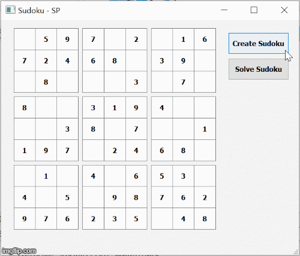

# Sudoku Generator and Solver
## Table of Contents 
- [General information](#general-information)
- [Sudoku algorithm](#sudoku-algorithm)
- [Features](#features)
- [Setup](#setup)
  - [Compile](#compile)
  - [Link](#link)


## General information
* This application is written is C++ in object oriented programming and the GUI has been developed using Qt.

## Sudoku algorithm
* The programm creates a sudoku board by filling an empty grid with random numbers following the backtracking algorithm.
* Once the grid is complete, it creates a sudoku board by removing elements according to the level of difficulty.
* The sudoku board is solved using the backtracking algorithm. 



## Features
1. Generate a new sudoku board by clinkg "Create Sudoku"
2. Solve the current available sudoku board by clicking "Solve Sudoku"

## Setup
* Clone repository
```shell
git clone git@github.com:spriale/sudoku.git
```
* Install Qt > 5.13.2

### Compile

### Link

